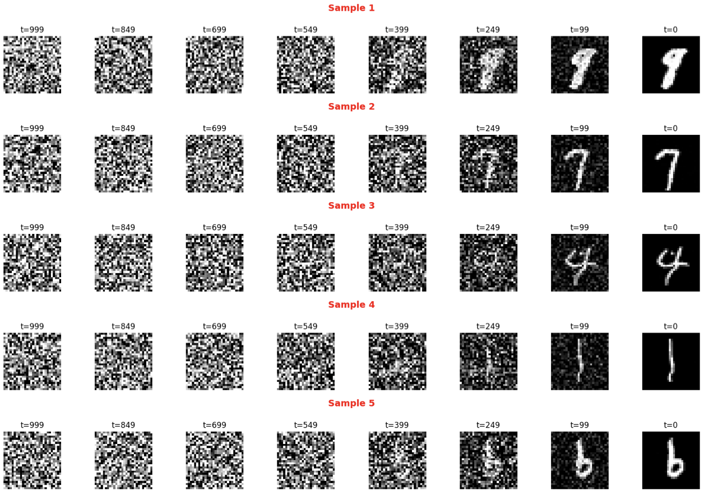
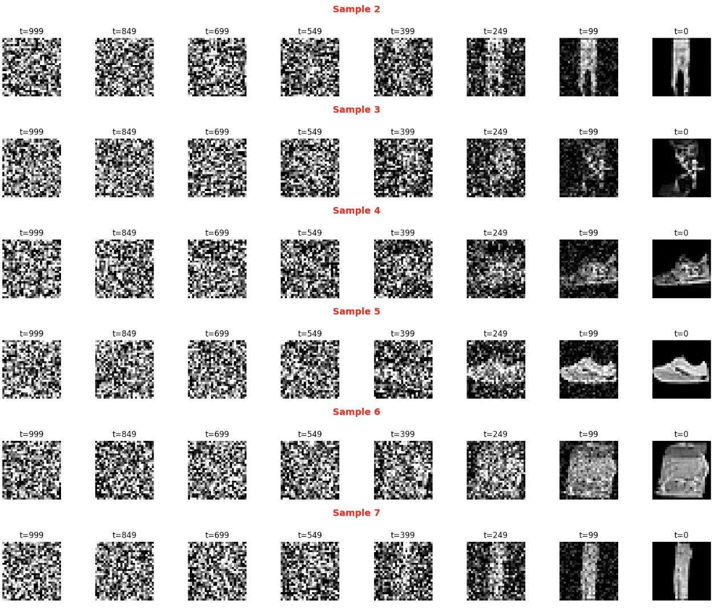

# Diffusion Models on MNIST & Fashion-MNIST
This project is a simple PyTorch implementation of Denoising Diffusion Probabilistic Models (DDPMs) applied to two datasets:
- MNIST – handwritten digits
- Fashion-MNIST – clothing items

The goal is to explore how well a basic UNet-based diffusion model can learn the data distribution and generate samples starting from pure noise. I am currently working on a bigger project which incorporates Diffusion models, however this was the starting point of me learning about DDPMs.

The implementation follows the original [DDPM paper](https://arxiv.org/abs/2006.11239) (all theoretical background, formulas, and derivations can be found there).

This repo is meant as an educational experiment, focusing on:
- training a diffusion model from scratch
- visualizing the forward (noising) and reverse (denoising) process
- comparing sample quality on different datasets

## Some examples:
- MNIST Handwritten Digits:

- MNIST Fashion Items:

